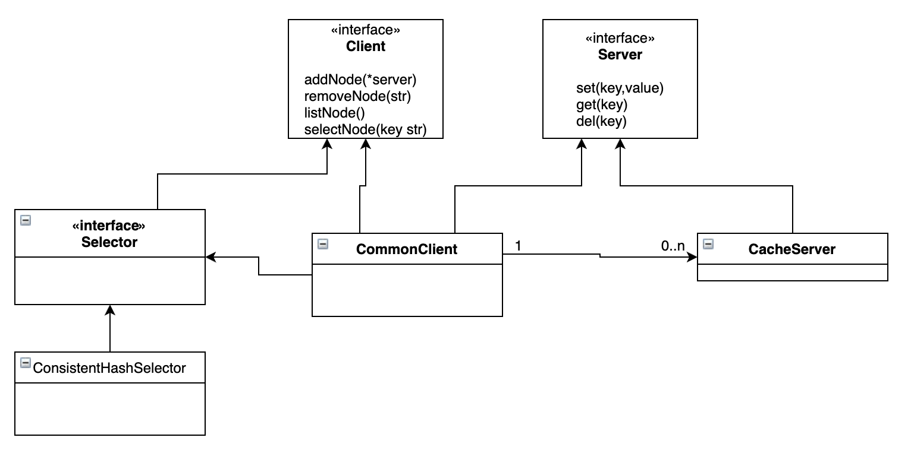

# consistenhashcachclient

这是用golang实现的一个缓存客户端原型，实现了一个一致性哈希算法。

测试用例中，cacheSvrList设置缓存服务器节点，Cache.NewConsistenHashNodeSelector(*n*)，n可以设置每台服务器生成的虚拟节点个数。

TestSetAndGetKV测试用例会向缓存服务器写入100万个键值对。
TestAvg显示了每台服务器存储的键值对数量，其中stdev显示了键值对分布的标准差。
> === RUN   TestAvg  
>      TestAvg: commonClient_test.go:70: data size list: [260674 241916 244536 252874]
>      TestAvg: commonClient_test.go:71: stdev: 7372.253793786538